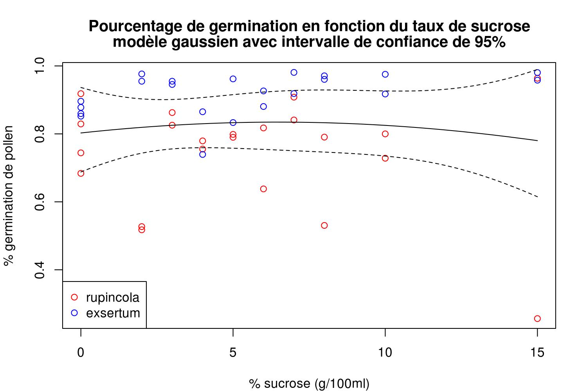

# Protocole pour tests de germination pollinique
*Étienne Léveillé-Bourret, 28 mai 2012*

## Solutions

### Solution stock de Brewbaker & Kwack 10X (50 ml)
 1. Peser 0,050 g de H3BO3
 2. Peser 0,150 g de CA(NO3)2 · H2O
 3. Peser 0,050 g de KNO3
 4. Peser  0,100 g de MgSO4  ·  7H2O
 5. Ajuster la solution à 50 ml avec H20 déminéralisée.
 6. Conserver au congélateur.

### Solution de sucrose 15% (10 ml)
 7. Peser 1,5 g de sucrose.
 8. Ajuster solution à 10 ml avec H20 déminéralisée.
 9. Ne se conserve pas.

### Solutions pour tests polliniques (3 ml)

La concentration idéale de sucrose semble être autour de 6-8% (masse/volume) (voir figure).

Il est donc recommandé de choisir la recette à 7% de sucrose comme standard. Préparer cette solution dans une petit erlenmeyer de 25 ml.

Qté BK 10X (ul) | Qté sucrose 15% (ul) | Qté H2O (ul) | Concent. finale sucrose (%)
300|2000|700|10
300|1800|900|9
300|1600|1100|8
300|1400|1300|7
300|1200|1500|6
300|1000|1700|5

## Protocole
 1. Préparer 3 ml de solution BK+sucrose dans erlenmeyers de 25 ml. Noter sur chaque erlenmeyer l'espèce qui y est déposé.
 2. Déposer tout le pollen (8 anthères) d'une fleur dans chaque erlenmeyer. Au besoin, couper les anthères (au niveau du filet) et les déposer au complet dans l'erlenmeyer.
 3. Vortexer abondamment de façon à disperser le pollen.
 4. Noter l'heure.
 5. Faire incuber à environ 60 rpm durant au moins une heure.
 6. Déposer deux gouttes de 20 ul de chaque erlenmeyer sur une lame, couvrir chaque goutte d'une lamelle. Bien s'assurer d'homogénéiser doucement le contenu de l'erlenmeyer avec le tip de la pipette avant d'aspirer. Noter l'espèce et le réplicat sur la lame.
 7. Compter au moins 100 grains de pollen sur chaque lamelle. Au s'attend à avoir au moins 80% (préférablement plus de 90%) de germination dans une espèce fertile...

### Notes
Il y a pas mal de variance entre différentes lamelles et entre différentes fleurs. Cela est probablement dû au fait qu'il est difficile d'homogénéiser la solution sans briser les tubes polliniques, et peut-être aussi à cause de différents niveaux de maturité des fleurs utilisées. Je crois qu'il serait donc pertinent de tester au moins 2 fleurs avec 2 lamelles par fleur.

### Références

Brewbaker J, Kwack B (1963) The essential role of calcium ion in pollen germination and pollen tube growth. ''American Journal of Botany'' 50:859–865.
